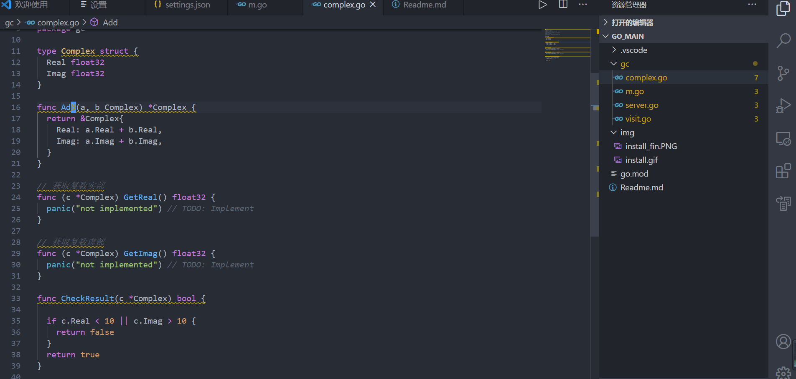
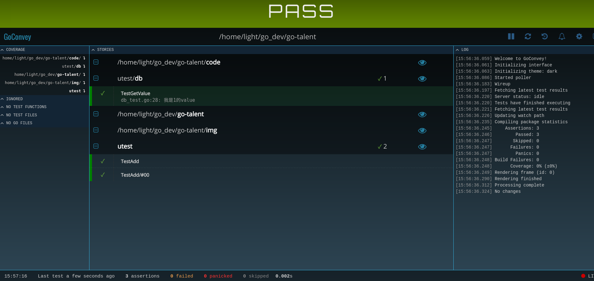

## 11.单元测试

> 本节代码样例见code/utest文件夹

在日常开发中，我们通常需要针对现有的功能进行单元测试，以验证开发的正确性。
在go标准库中有一个叫做`testing`的测试框架，可以进行单元测试，命令是`go test xxx`。

测试文件通常是以`xx_test.go`命名，放在同一包下面。

### 11.1 初探Go单元测试

现在假设现在需求是：完成两个复数相加,我们只需要一个函数便可以完成该任务。

在开发中，我们需要对该函数进行功能测试，如何快速进行单元测试呢？

鼠标放在函数上右键，选择GO:Generate Unit Tests For Function即可生成file_test.go文件。

看下面动画：



随后在测试文件中完成测试功能即可,可以进入code/utest里面的complex_test进行单元测试。


### 11.2 单测要点

第一：单元测试的时候，如果有一些打印log信息，我们运行xxx_test.go是输出不出来的，此时需要使用：
```
go test xxx_test.go -v
```
使用-v参数可以帮助我们解决此问题。

第二：单测覆盖率，覆盖率可以简单理解为进行单元测试mock的时候，能够覆盖的代码行数占总代码行数的比率，当然是高一点要好些。可以通过`-cover`指定

```go
go test xxx_test -v -cover
```

第三：在上述提到的测试方法中我们使用的是(table-driven tests)表格驱动型测试，我们看一下代码：
```go
tests := []struct {
	name string
	args args
	want *Complex
}{
	// TODO: Add test cases.
	{
		name: "",
		args: args{
			a: Complex{
				Real: 1.0,
				Imag: 2.0,
			},
			b: Complex{
				Real: 1.0,
				Imag: 1.0,
			},
		},
		want: &Complex{
			Real: 2.0,
			Imag: 3.0,
		},
	},
}
```
在TODO里面我们可以填写很多单元测试样例。


### 11.3 基准测试

基准测试函数名字必须以Benchmark开头，代码在xxx_test.go中。具体如下：

```go
func BenchmarkComplex(t *testing.B) {
	for i := 0; i < t.N; i++ {
		fmt.Sprintf("hello")
	}
}
```
运行：
```go
go test -benchmem -run=. -bench=.
```
```go
输出：
goos: linux
goarch: amd64
BenchmarkComplex-8   	20542494	        58.9 ns/op	       5 B/op	       1 allocs/op
PASS
ok  	_/home/light/go_dev/go-talent/code/utest	1.272s
```
20542494表示for循环的测试，58.9表示每次需要花费58.9纳秒。
`-benchmem`可以提供每次操作分配内存的次数，以及每次操作分配的字节数。
allocs/op 表示每次操作从堆上分配内存的次数。B/op 表示每次操作分配的字节数。

### 11.4 mock/stub测试

gomock是官方提供的mock框架，同时有mockgen工具来辅助生成测试代码。

> https://github.com/golang/mock

需要自己先安装一下：
```go
go get -u github.com/golang/mock/gomock
go get -u github.com/golang/mock/mockgen
```

下面以DB为例，有如下接口：
```go
type DB interface {
	Get(key int) (string, error)
}
```
我们想通过Get接口返回对应value。于是写出了下面这个函数：
```go
func GetValue(db DB, key int) (string, error) {
	value, err := db.Get(key)
	if err != nil {
		return "", errors.New("fail")
	}
	return value, nil
}
```
我们现在比较关心的是当前我们写的函数是否正确，而中间调用了Get接口，该接口我们可以进行mock，首先使用下面命令：
```
mockgen -source=db.go -destination=db_mock.go -package=db
```
随后在单元测试文件中进行go mock即可。
```go
func TestGetValue(t *testing.T) {
	ctrl := gomock.NewController(t)
  defer ctrl.Finish()

	m := NewMockDB(ctrl)
	m.EXPECT().Get(gomock.Eq(1)).Return("我是1的value", nil)

	if v, err := GetValue(m, 1); err != nil {
		t.Error(err)
	} else {
		t.Log(v)
	}
}
```

其中比较重要的是打桩(stubs)：
```
m.EXPECT().Get(gomock.Eq(1)).Return("我是1的value", nil)
```
这一行我们mock掉了Get接口，假设其返回字符串(我是1的value)与nil，随后进行逻辑测试。

这种方式的好处是不直接依赖的实例，而是使用依赖注入降低耦合性。

### 11.5 直接替换

在1.4中我们是需要进行打桩并使用mockgen才可以完成一些复杂api的测试的，那有没有更简单的方法呢，例如：直接替换函数为想要的函数，在github上有monkey库为我们使用。

输入下面命令进行安装：
> go get github.com/bouk/monkey

假设有Get接口的实现者是Handler，那么我们直接使用monkey进行方法替换，把Get方法替换为我们自己的，仅此一步搞定单元测试，非常方便。

```go
func TestGetValue1(t *testing.T) {
	var h *Handler
	monkey.PatchInstanceMethod(reflect.TypeOf(h), "Get", func(handler *Handler, key int) (string, error) {
		return "我是1的value", nil
	})
	if v, err := GetValue(h, 1); err != nil {
		t.Error(err)
	} else {
		t.Log(v)
	}
}
```

### 11.6 浏览器实时测试

接下来引入一个比较方便的单元测试框架，可以在浏览器进行实时查看单元测试结果。只需要三步即可。

第一步：
```
go get github.com/smartystreets/goconvey
```
第二步：
```
$GOPATH/bin/goconvey
```
第三步：
```
http://localhost:8080
```
此时在页面可以看到下面这个。


除此之外，我们看到使用vscode生成的单元测试(table-driven tests)贼丑，那么我们可以使用convey进行单测。
```go
func TestSpec(t *testing.T) {
	// Only pass t into top-level Convey calls
	Convey("Given some integer with a starting value", t, func() {
		x := 1
		Convey("When the integer is incremented", func() {
			x++
			Convey("The value should be greater by one", func() {
				So(x, ShouldEqual, 2)
			})
		})
	})
}
```
使用convey进行包裹起来好看的一匹。
