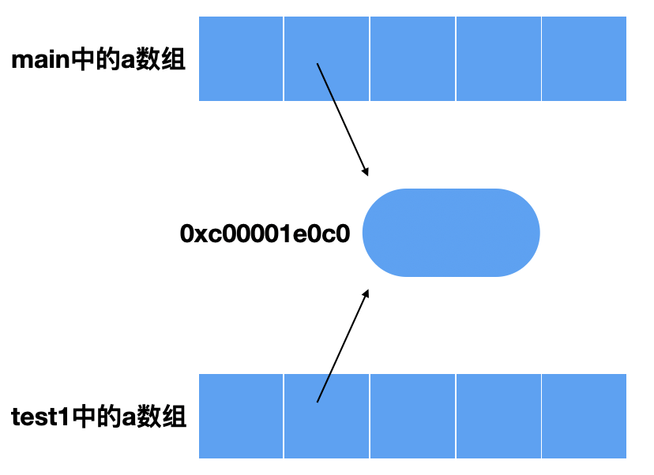
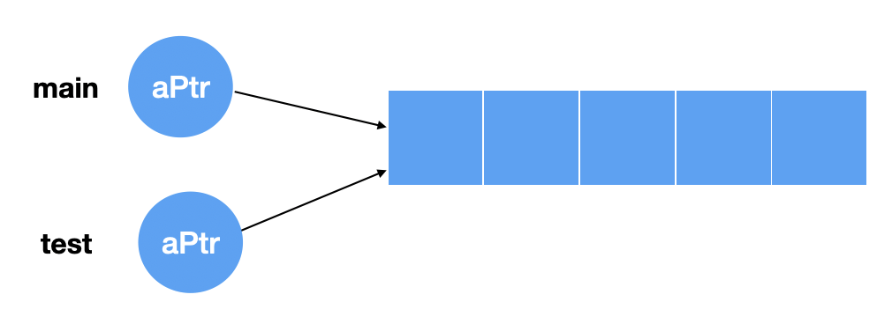

# 数组

## 如何定义数组

数组是具有相同类型且长度固定的一组连续数据。在go语言中我们可以使用如下几种方式来定义数组。

```go
//方式一
var arr1 = [5]int{}
//方式二
var arr2 = [5]int{1,2,3,4,5}
//方式三
var arr3 = [5]int{3:10}
```

输出以上三个变量的值如下所示：

```go
arr1 [0 0 0 0 0]
arr2 [1 2 3 4 5]
arr3 [0 0 0 10 0]
```

- 方法一在声明时没有为其指定初值，所以数组内的值被初始化为类型的零值。
- 方法二使用显示的方式为数组定义初值。
- 方法三通过下标的方式为下标为3的位置赋上了初值10

而且在数组的定义是包含其长度的，也就是说[3]int与[4]int是两种不同的数据类型。

## 如何操作数据

在上面的arr1我们没有为其指定初值，那么之后我们可以通过循环的方式为其赋予初值

```go
for i := 0; i < len(arr1); i++ {
		arr1[i] = i * 10
	}
```

此时我们再输出一下数组arr1，可以看到其值已经变化

```go
arr1 update:  [0 10 20 30 40]
```

我们还可以通过循环的方式遍历数组，与上面不同的是，for循环提供这样的方式来为便利数组

```go
for index, value := range arr1 {
		fmt.Printf("index: %d, value: %d\n", index, value)
	}
```

通过range来遍历数组会有两个返回值，其中第一个为数组的索引，第二个位置为对应的值，输出结果如下：

```go
index: 0, value: 0
index: 1, value: 10
index: 2, value: 20
index: 3, value: 30
index: 4, value: 40
```

当然不想要索引值也是可以的，可以用`_`代替。

## 多维数组

与其他语言一样，go语言也可以定义多维数组，可以选择的定义方式如下：

```go
var arr4 = [5][5]int{
		{1, 2, 3, 4, 5},
		{6, 7, 8, 9, 10},
	}
```

输出当前数组，可以看到数组内的值如下所示

```go
[[1 2 3 4 5] [6 7 8 9 10] [0 0 0 0 0] [0 0 0 0 0] [0 0 0 0 0]]
```

## 数组作为函数参数

go语言在传递数组时会对其进行拷贝，所以如果传递的是大数组的话会非常占内存，所以一般情况下很少直接传递一个数组，避免这种情况我们可以使用以下两种方式：

- 传递数组的指针
- 传递切片（具体内容见下一小节）

## 指针数组与数组指针

对于指针数组和数组指针在c或c++中也经常被讨论，尤其对于初学者来说会分辨不清楚。其实在每个词中间添加一个“的“就很好理解了，指针的数组，数组的指针。

### 指针数组

对于指针数组来说，就是：一个数组里面装的都是指针，在go语言中数组默认是值传递的，所以如果我们在函数中修改传递过来的数组对原来的数组是没有影响的。

```go
func main() {
	var a [5]int
	fmt.Println(a)
	test(a)
	fmt.Println(a)
}


func test(a [5]int) {
	a[1] = 2
	fmt.Println(a)
}
```

输出

```go
[0 0 0 0 0]
[0 2 0 0 0]
[0 0 0 0 0]
```

但是如果我们一个函数传递的是指针数组，情况会有什么不一样呢？

```go
func main() {
	var a [5]*int
	fmt.Println(a)
	for i := 0; i < 5; i++ {
		temp := i
		a[i] = &temp
	}
	for i := 0; i < 5; i++ {
		fmt.Print(" ", *a[i])
	}
	fmt.Println()
	test1(a)
	for i := 0; i < 5; i++ {
		fmt.Print(" ", *a[i])
	}
}


func test1(a [5]*int) {
	*a[1] = 2
	for i := 0; i < 5; i++ {
		fmt.Print(" ", *a[i])
	}
	fmt.Println()
}
```

我们先来看一下程序的运行结果

```go
[<nil> <nil> <nil> <nil> <nil>]
 0 1 2 3 4
 0 2 2 3 4
 0 2 2 3 4
```

可以看到初始化值全是nil，也就验证了指针数组内部全都是一个一个指针，之后我们将其初始化，内部的每个指针指向一块内存空间。

*注：在初始化的时候如果直接另a[i] = &i那么指针数组内部存储的全是同一个地址，所以输出结果也一定是相同的*

然后我们将这个指针数组传递给test1函数，**对于数组的参数传递仍然是复制的形式也就是值传递**，但是因为数组中每个元素是一个指针，所以test1函数复制的新数组中的值仍然是这些指针指向的具体地址值，这时改变a[1]这块存储空间地址指向的值，那么原实参指向的值也会变为2，具体流程如下图所示。



### 数组指针

了解了指针数组之后，再来看一下数组指针，数组指针的全称应该叫做，指向数组的指针，在go语言中我们可以如下操作。

```go
func main() {
	var a [5]int
	var aPtr *[5]int
	aPtr = &a
	//这样简短定义也可以aPtr := &a
	fmt.Println(aPtr)
	test(aPtr)
	fmt.Println(aPtr)
}


func test(aPtr *[5]int) {
	aPtr[1] = 5
	fmt.Println(aPtr)
}
```

我们先定义了一个数组a，然后定一个指向数组a的指针aPtr，然后将这个指针传入一个函数，在函数中我们改变了具体的值，程序的输出结果

```go
&[0 0 0 0 0] 
&[0 5 0 0 0] 
&[0 5 0 0 0]
```



通过上面的图我们可以看见虽然main和test函数中的aPtr是不同的指针，但是他们都指向同一块数组的内存空间，所以无论在main函数还是在test函数中对数组的操作都会直接改变数组。

# 切片

因为数组是固定长度的，所以在一些场合下就显得不够灵活，所以go语言提供了一种更为便捷的数据类型叫做切片。切片操作与数组类似，但是它的长度是不固定的，可以追加元素，如果以达到当前切片容量的上限会再自动扩容。

## 如何定义切片

可以通过以下几种方式定义切片

```go
//方法一
var s1 = []int{}
//方法二
var s2 = []int{1, 2, 3}
//方法三
var s3 = make([]int, 5)
//方法四
var s4 = make([]int, 5, 10)
```

方法一声明了一个空切片，方法二声明了一个长度为3的切片，方法三声明了一个长度为5的空切片，方法四声明了一个长度为5容量为10的切片。可以看到切片的定义与数组类似，但是定义切片不需要为其指定长度。

我们可以通过`len()`和`cap()`这两个函数来获取切片的长度和容量，下面就来依次看下上面各切片的长度以及容量。

```go
s1 [] 0 0
s2 [1 2 3] 3 3
s3 [0 0 0 0 0] 5 5
s4 [0 0 0 0 0] 5 10
```

如果我们通过这种方式定义一个切片，那么他会被赋予切片的空值nil。

```go
var s5 []int
```

## 切片操作

我们可以通过如下的方式在数组和切片上继续获取切片

```go
func main() {
	arr := [5]int{1, 2, 3, 4, 5}
	s := []int{6, 7, 8, 9, 10}

	s1 := arr[2:4]
	s2 := arr[:3]
	s3 := arr[2:]
	s4 := s[1:3]

	fmt.Println("s1:", s1)
	fmt.Println("s2:", s2)
	fmt.Println("s3:", s3)
	fmt.Println("s4:", s4)
}
```

程序的输出结果如下

```go
s1: [3 4]
s2: [1 2 3]
s3: [3 4 5]
s4: [7 8]
```

可以看到切片操作是“包左不包右”，例如arr[2:4]是选择arr数组内下标为2，3的两个元素。如果`:`左边没有起始位置则默认从头开始，同理如果右边没有终止位置则默认到末尾。

## 切片与数组的关系

对于任何一个切片来说，其都有一个底层数组。

小切片引用大数组会造成垃圾回收问题。

## 切片的拼接与扩充

